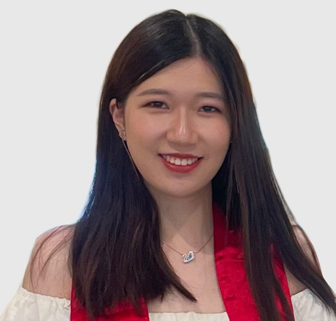

# A brief introduction of myself

I'm currently a graduate student major in Biostatistics at Columbia University. Before I came to New York, I spent four years in Maryland to finish my undergraduate courses at University of Maryland. I was double major in Mathematics and Economics because I’m interested in dealing with numbers and data. My future plan is to be a data analyst.

Here's a photo of me:  

# Links to my site
* [My Resume](about.html)

* [Dashboard](Dashboard.html)